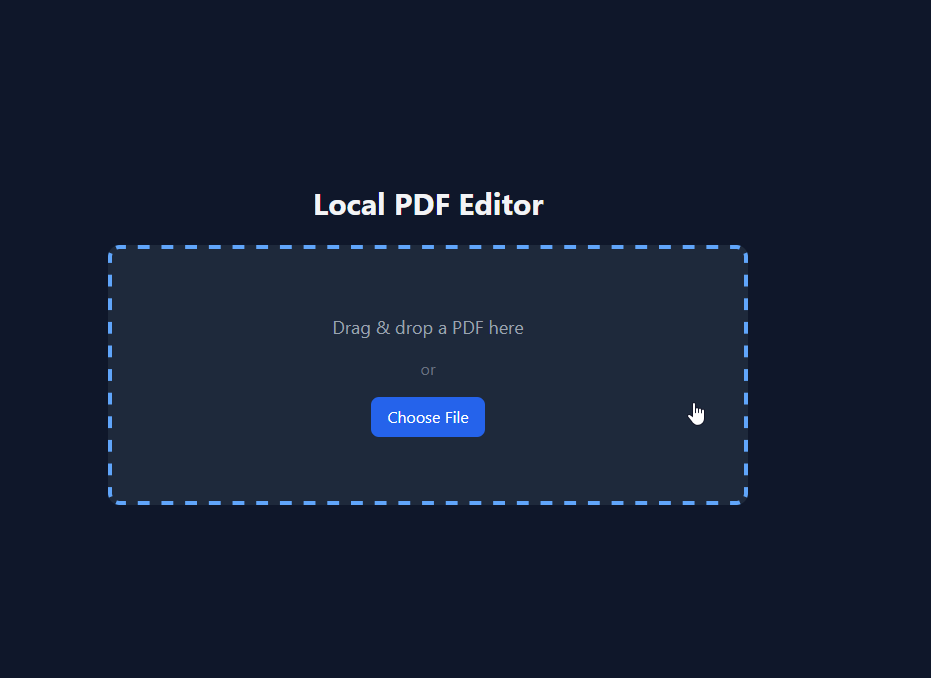
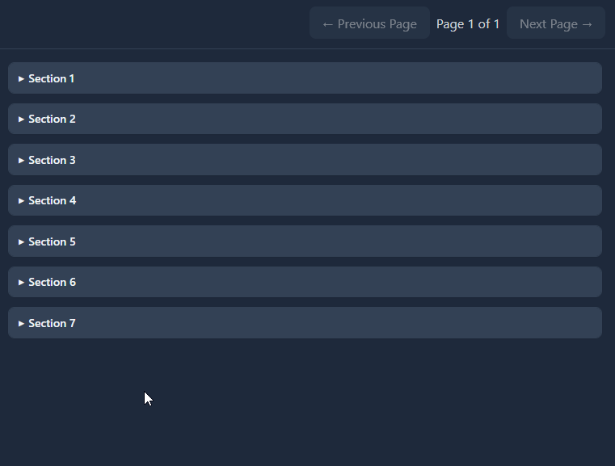
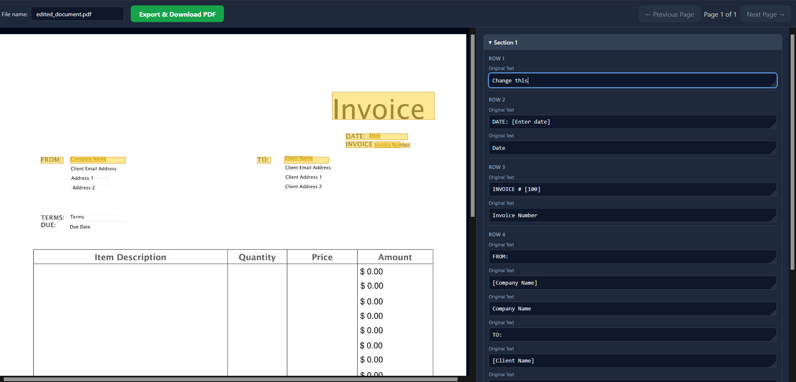

<div align="center">
  <h1>📄 Local PDF Vector & OCR Editor</h1>
  <p><strong>A sleek, 100% offline, privacy-first desktop web application.</strong></p>

  [](#)
  [](#)
  [](#)
  [](#)
</div>

---

## 💡 Why this exists

I edit PDFs more often than I'd like to admit — mostly invoices, sometimes forms, sometimes a scanned document someone sent me that really should've been a text file. Every time, I'd end up on one of those free online PDF editors, tweak a couple of fields, hit export... and get told I'd used up my free edits for the day. Come back tomorrow, or pay up.

That's a strange thing to run into for editing your *own* documents on your *own* computer. So one weekend, instead of waiting out the daily limit again, I sat down and built this instead.

**A quick example:** say you send out a handful of invoices every month and just need to swap the client name, the date, and a line item or two each time. On a hosted editor, that's a few uploads, a few waits, and eventually a paywall. Here, you drag the PDF in, the fields show up on the right, you edit them, and it saves — right there on your machine, as many times as you want, whenever you want. No daily cap, no account, no upload to somewhere else.

That's really the whole idea: something that works exactly like the paid tools, minus the meter running in the background. **No cloud, no limits, total privacy.**

## ✨ Key Features

- 🌗 **Premium Dark Mode:** A sleek, slate-gray interface designed to reduce eye strain.
- 📑 **Split-Pane Data Entry:** The PDF renders on the left, while editable text fields are automatically organized in a scrolling panel on the right.
- 🧠 **Smart Y-Axis Grouping:** An advanced backend algorithm groups disconnected PDF text elements into logical, easy-to-read rows and sections.
- 🔍 **Tesseract OCR Fallback:** Upload a flat, scanned document? The app automatically triggers local Tesseract OCR to extract and map the text.
- 🎨 **Font & Color Preservation:** Edits are written back into the PDF using the original font styles and colors to blend in seamlessly.
- 🔒 **100% Offline Support:** All frontend dependencies (Tailwind, Fabric.js) are locally vendored.

## 📸 Interface Preview

| Homepage | Edit Sections | Edit PDF Page |
|---|---|---|
|  |  |  |

---

## 🚀 Getting Started

### Prerequisites
- **OS:** Windows 11
- **Python:** v3.10+ (Added to system PATH)

### Installation
1. Clone this repository:
   ```bash
   git clone https://github.com/anshusangita08/local-pdf-editor.git
   cd local-pdf-editor
   ```
2. Run the automated setup (installs Python dependencies & Tesseract OCR):
   ```bash
   setup.bat
   ```

### Launching the App
Simply double-click `start.bat`.
The FastAPI backend will boot up and automatically open your default browser to `http://localhost:8000`.

## 🏗️ Tech Stack

| Component | Technology | Purpose |
|---|---|---|
| Backend | FastAPI (Python) | High-performance local server and API routing. |
| PDF Engine | PyMuPDF (fitz) | Vector text extraction, coordinate mapping, and redaction. |
| OCR Engine | Tesseract | Local optical character recognition for scanned images. |
| Frontend UI | Tailwind CSS | Rapid, modern dark-mode styling. |
| Canvas | Fabric.js | Pixel-perfect bounding box alignment and cross-highlighting. |

## 🤝 Credits & Open Source

This application stands on the shoulders of giants. Huge thanks to:

- [PyMuPDF (Artifex)](https://github.com/pymupdf/PyMuPDF)
- [Tesseract OCR (UB-Mannheim)](https://github.com/UB-Mannheim/tesseract)
- [Fabric.js](https://github.com/fabricjs/fabric.js)
